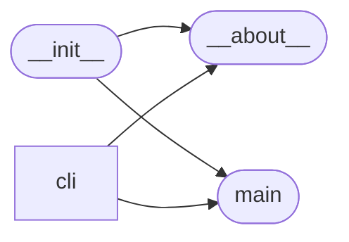

# Code Overview

[_Documentation generated by Documatic_](https://www.documatic.com)

<!---Documatic-section-Codebase Structure Python-start--->
## Codebase Structure Python

The codebase has a single-depth folder structure,
                with 7 code files in total.

<!---Documatic-block-system_architecture-start--->

<!---Documatic-block-system_architecture-end--->

# #
<!---Documatic-section-Codebase Structure Python-end--->

<!---Documatic-section-Key Objects-start--->
## Key Objects

There are exposed imports at level-0
from the source directory (stressberry)

<!---Documatic-block-stressberry-start--->

	
<code>stressberry</code> (Click to Expand!)

* `stressberry.__about__.__version__`
* `stressberry.main.stress_cpu`

<!---Documatic-block-stressberry-end--->

# #
<!---Documatic-section-Key Objects-end--->

<!---Documatic-section-Important Functions-start--->
## Important Functions

<!---Documatic-block-important_funcs-start--->
<!---Documatic-block-most_used_funcs-start--->
### Most Utilised Functions

* stressberry.__about__.__version__ (3 times)
* [stressberry.cli.helpers._get_version_text](4-stressberry_cli.md#stressberry.cli.helpers._get_version_text) (2 times)
* [stressberry.main.stress_cpu](3-stressberry_main.md#stressberry.main.stress_cpu) (1 times)
* [stressberry.main.cooldown](3-stressberry_main.md#stressberry.main.cooldown) (1 times)
* [stressberry.main.measure_ambient_temperature](3-stressberry_main.md#stressberry.main.measure_ambient_temperature) (1 times)
* [stressberry.main.measure_core_frequency](3-stressberry_main.md#stressberry.main.measure_core_frequency) (1 times)
* [stressberry.main.measure_temp](3-stressberry_main.md#stressberry.main.measure_temp) (1 times)
* [stressberry.main.test](3-stressberry_main.md#stressberry.main.test) (1 times)
* [stressberry.cli.plot.plot](4-stressberry_cli.md#stressberry.cli.plot.plot) (1 times)
* [stressberry.cli.run.run](4-stressberry_cli.md#stressberry.cli.run.run) (1 times)
<!---Documatic-block-most_used_funcs-end--->

<!---Documatic-block-end_user_funcs-start--->
### End User Exposed Functions

* stressberry.__about__.__version__
* [stressberry.main.stress_cpu](3-stressberry_main.md#stressberry.main.stress_cpu)
<!---Documatic-block-end_user_funcs-end--->
<!---Documatic-block-important_funcs-end--->

# #
<!---Documatic-section-Important Functions-end--->

<!---Documatic-section-File IO-start--->
## File IO

<!---Documatic-block-file_io-start--->
The following files have file read operations

<!---Documatic-block-stressberry-start--->

	
<code>stressberry</code> (Click to Expand!)

* stressberry.main

<!---Documatic-block-stressberry-end--->
<!---Documatic-block-file_io-end--->

# #
<!---Documatic-section-File IO-end--->

[_Documentation generated by Documatic_](https://www.documatic.com)