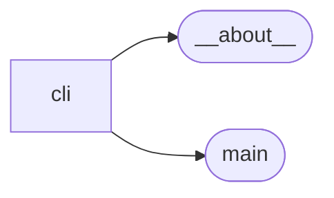
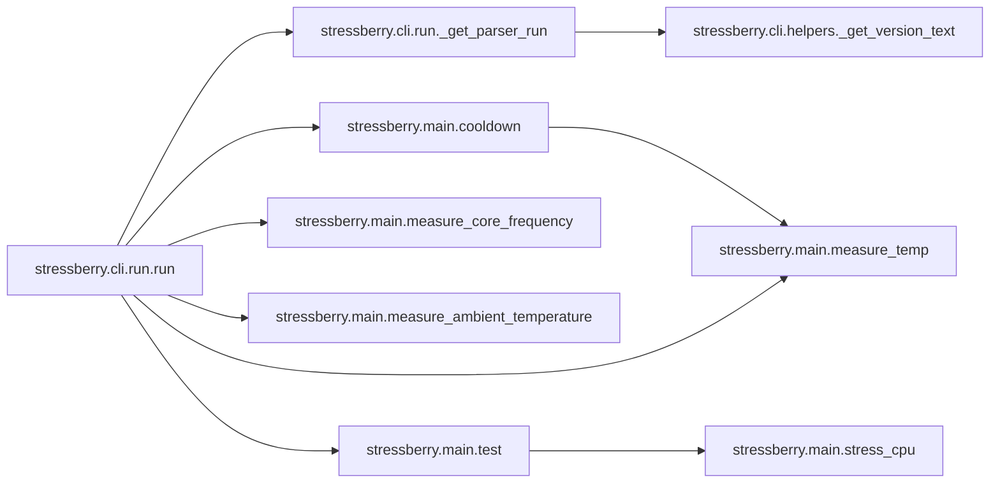

# Stressberry Cli

[_Documentation generated by Documatic_](https://www.documatic.com)

<!---Documatic-section-Codebase Structure-start--->
## Codebase Structure

<!---Documatic-block-system_architecture-start--->

<!---Documatic-block-system_architecture-end--->

# #
<!---Documatic-section-Codebase Structure-end--->

<!---Documatic-section-stressberry.cli.plot.plot-start--->
## [stressberry.cli.plot.plot](4-stressberry_cli.md#stressberry.cli.plot.plot)

<!---Documatic-section-plot-start--->


### Object Calls

* [stressberry.cli.plot._get_parser_plot](4-stressberry_cli.md#stressberry.cli.plot._get_parser_plot)

<!---Documatic-block-stressberry.cli.plot.plot-start--->
<details>
	<summary><code>stressberry.cli.plot.plot</code> code snippet</summary>

```python
def plot(argv=None):
    import matplotx
    import matplotlib.pyplot as plt
    plt.style.use(matplotx.styles.dufte)
    parser = _get_parser_plot()
    args = parser.parse_args(argv)
    data = [yaml.load(f, Loader=yaml.SafeLoader) for f in args.infiles]
    fig = plt.figure()
    ax1 = fig.add_subplot(1, 1, 1)
    for d in data:
        temperature_data = d['temperature']
        if args.delta_t:
            temperature_data = []
            zip_object = zip(d['temperature'], d['ambient'])
            for (d['temperature'], d['ambient']) in zip_object:
                temperature_data.append(d['temperature'] - d['ambient'])
        plt.plot(d['time'], temperature_data, label=d['name'])
    matplotx.line_labels()
    if args.delta_t:
        plot_yaxis_label = 'Δ temperature [°C over ambient]'
    else:
        plot_yaxis_label = 'temperature [°C]'
    plt.xlabel('time [s]')
    plt.ylabel(plot_yaxis_label)
    if args.temp_lims:
        ax1.set_ylim(*args.temp_lims)
    if len(data) == 1 and args.frequency:
        ax2 = plt.twinx()
        ax2.set_ylabel('core frequency (MHz)')
        if args.freq_lims:
            ax2.set_ylim(*args.freq_lims)
        try:
            for d in data:
                ax2.plot(d['time'], d['cpu frequency'], label=d['name'], color='C1', alpha=0.9)
            ax1.set_zorder(ax2.get_zorder() + 1)
            ax1.patch.set_visible(False)
        except KeyError():
            print('Source data does not contain CPU frequency data.')
    if args.outfile is not None:
        plt.savefig(args.outfile, transparent=args.transparent, bbox_inches='tight', dpi=args.dpi)
    else:
        plt.show()
    return
```
</details>
<!---Documatic-block-stressberry.cli.plot.plot-end--->
<!---Documatic-section-plot-end--->

# #
<!---Documatic-section-stressberry.cli.plot.plot-end--->

<!---Documatic-section-stressberry.cli.plot._get_parser_plot-start--->
## [stressberry.cli.plot._get_parser_plot](4-stressberry_cli.md#stressberry.cli.plot._get_parser_plot)

<!---Documatic-section-_get_parser_plot-start--->


### Object Calls

* [stressberry.cli.helpers._get_version_text](4-stressberry_cli.md#stressberry.cli.helpers._get_version_text)

<!---Documatic-block-stressberry.cli.plot._get_parser_plot-start--->
<details>
	<summary><code>stressberry.cli.plot._get_parser_plot</code> code snippet</summary>

```python
def _get_parser_plot():
    parser = argparse.ArgumentParser(description='Plot stress test data.')
    parser.add_argument('--version', '-v', action='version', version=_get_version_text())
    parser.add_argument('infiles', nargs='+', type=argparse.FileType('r'), help='input YAML file(s) (default: stdin)')
    parser.add_argument('-o', '--outfile', help='if specified, the plot is written to this file (default: show on screen)')
    parser.add_argument('-t', '--temp-lims', type=float, nargs=2, default=None, help='limits for the temperature (default: data limits)')
    parser.add_argument('-d', '--dpi', type=int, default=None, help='image resolution in dots per inch when written to file')
    parser.add_argument('-f', '--frequency', help='plot CPU core frequency (single input files only)', action='store_true')
    parser.add_argument('-l', '--freq-lims', type=float, nargs=2, default=None, help='limits for the frequency scale (default: data limits)')
    parser.add_argument('--not-transparent', dest='transparent', help='do not make images transparent', action='store_false', default=True)
    parser.add_argument('--delta-t', action='store_true', default=False, help='Use Delta-T (core - ambient) temperature instead of CPU core temperature')
    return parser
```
</details>
<!---Documatic-block-stressberry.cli.plot._get_parser_plot-end--->
<!---Documatic-section-_get_parser_plot-end--->

# #
<!---Documatic-section-stressberry.cli.plot._get_parser_plot-end--->

<!---Documatic-section-stressberry.cli.run._get_parser_run-start--->
## [stressberry.cli.run._get_parser_run](4-stressberry_cli.md#stressberry.cli.run._get_parser_run)

<!---Documatic-section-_get_parser_run-start--->


### Object Calls

* [stressberry.cli.helpers._get_version_text](4-stressberry_cli.md#stressberry.cli.helpers._get_version_text)

<!---Documatic-block-stressberry.cli.run._get_parser_run-start--->
<details>
	<summary><code>stressberry.cli.run._get_parser_run</code> code snippet</summary>

```python
def _get_parser_run():
    parser = argparse.ArgumentParser(description='Run stress test for the Raspberry Pi.')
    parser.add_argument('--version', '-v', action='version', version=_get_version_text())
    parser.add_argument('-n', '--name', type=str, default='stressberry data', help="name the data set (default: 'stressberry data')")
    parser.add_argument('-t', '--temperature-file', type=str, default=None, help='temperature file e.g /sys/class/thermal/thermal_zone0/temp (default: vcgencmd)')
    parser.add_argument('-d', '--duration', type=int, default=300, help='stress test duration in seconds (default: 300)')
    parser.add_argument('-i', '--idle', type=int, default=150, help='idle time in seconds at start and end of stress test (default: 150)')
    parser.add_argument('--cooldown', type=int, default=60, help='poll interval seconds to check for stable temperature (default: 60)')
    parser.add_argument('-c', '--cores', type=int, default=None, help='number of CPU cores to stress (default: all)')
    parser.add_argument('-f', '--frequency-file', type=str, default=None, help='CPU core frequency file e.g. /sys/devices/system/cpu/cpu0/cpufreq/scaling_cur_freq (default: vcgencmd)')
    parser.add_argument('-a', '--ambient', type=str, nargs=2, default=None, help='measure ambient temperature. Sensor Type [11|22|2302] <GPIO Number> e.g. 2302 26')
    parser.add_argument('outfile', type=argparse.FileType('w'), help='output data file')
    return parser
```
</details>
<!---Documatic-block-stressberry.cli.run._get_parser_run-end--->
<!---Documatic-section-_get_parser_run-end--->

# #
<!---Documatic-section-stressberry.cli.run._get_parser_run-end--->

<!---Documatic-section-stressberry.cli.run.run-start--->
## [stressberry.cli.run.run](4-stressberry_cli.md#stressberry.cli.run.run)

<!---Documatic-section-run-start--->


### Object Calls

* [stressberry.cli.run._get_parser_run](4-stressberry_cli.md#stressberry.cli.run._get_parser_run)
* [stressberry.main.cooldown](3-stressberry_main.md#stressberry.main.cooldown)
* [stressberry.main.measure_temp](3-stressberry_main.md#stressberry.main.measure_temp)
* [stressberry.main.measure_core_frequency](3-stressberry_main.md#stressberry.main.measure_core_frequency)
* [stressberry.main.measure_ambient_temperature](3-stressberry_main.md#stressberry.main.measure_ambient_temperature)
* [stressberry.main.test](3-stressberry_main.md#stressberry.main.test)

<!---Documatic-block-stressberry.cli.run.run-start--->
<details>
	<summary><code>stressberry.cli.run.run</code> code snippet</summary>

```python
def run(argv=None):
    parser = _get_parser_run()
    args = parser.parse_args(argv)
    print('Awaiting stable baseline temperature...')
    cooldown(interval=args.cooldown, filename=args.temperature_file)
    t = threading.Thread(target=lambda : test(args.duration, args.idle, args.cores), args=())
    t.start()
    times = []
    temps = []
    freqs = []
    ambient = []
    while t.is_alive():
        times.append(time.time())
        temps.append(measure_temp(args.temperature_file))
        freqs.append(measure_core_frequency(args.frequency_file))
        if args.ambient:
            ambient_temperature = measure_ambient_temperature(sensor_type=args.ambient[0], pin=args.ambient[1])
            if ambient_temperature is None:
                if not ambient:
                    print(f'Could not read ambient temperature sensor {args.ambient[0]} on pin {args.ambient[1]}')
                else:
                    print('WARN - Could not read ambient temperature, using last good value')
                ambient_temperature = next((temp for temp in reversed(ambient) if temp is not None), 0)
            ambient.append(ambient_temperature)
            delta_t = temps[-1] - ambient[-1]
            print(f'Temperature (current | ambient | ΔT): {temps[-1]:4.1f}°C | {ambient[-1]:4.1f}°C | {delta_t:4.1f}°C - Frequency: {freqs[-1]:4.0f}MHz')
        else:
            print(f'Current temperature: {temps[-1]:4.1f}°C - Frequency: {freqs[-1]:4.0f}MHz')
        t.join(2.0)
    time0 = times[0]
    times = [tm - time0 for tm in times]
    args.outfile.write(f'# This file was created by stressberry v{__version__} on {datetime.datetime.now()}\n')
    yaml.dump({'name': args.name, 'time': times, 'temperature': temps, 'cpu frequency': freqs, 'ambient': ambient}, args.outfile)
```
</details>
<!---Documatic-block-stressberry.cli.run.run-end--->
<!---Documatic-section-run-end--->

# #
<!---Documatic-section-stressberry.cli.run.run-end--->

<!---Documatic-section-stressberry.cli.helpers._get_version_text-start--->
## [stressberry.cli.helpers._get_version_text](4-stressberry_cli.md#stressberry.cli.helpers._get_version_text)

<!---Documatic-section-_get_version_text-start--->
<!---Documatic-block-stressberry.cli.helpers._get_version_text-start--->
<details>
	<summary><code>stressberry.cli.helpers._get_version_text</code> code snippet</summary>

```python
def _get_version_text():
    return '\n'.join(['stressberry {} [Python {}.{}.{}]'.format(__version__, sys.version_info.major, sys.version_info.minor, sys.version_info.micro), 'Copyright (c) 2017-2020 Nico Schlömer <nico.schloemer@gmail.com>'])
```
</details>
<!---Documatic-block-stressberry.cli.helpers._get_version_text-end--->
<!---Documatic-section-_get_version_text-end--->

# #
<!---Documatic-section-stressberry.cli.helpers._get_version_text-end--->

[_Documentation generated by Documatic_](https://www.documatic.com)